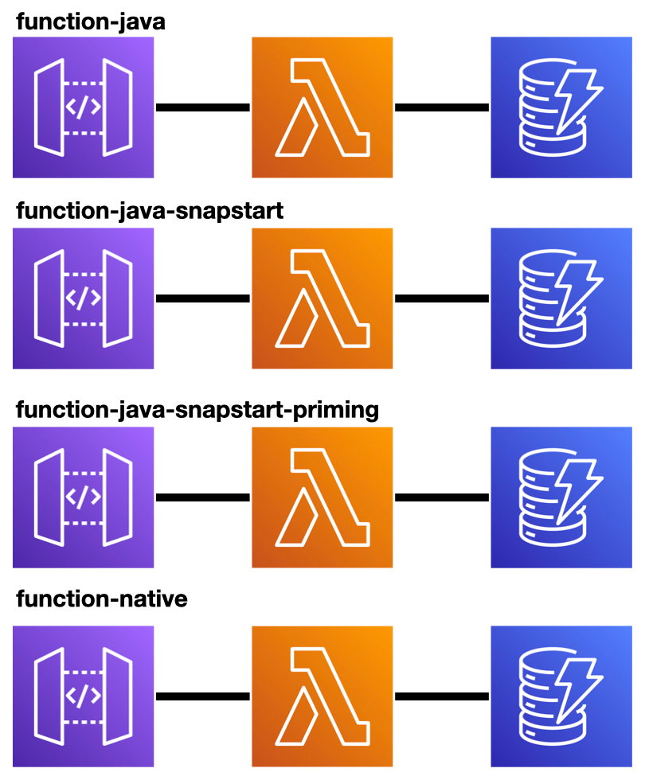
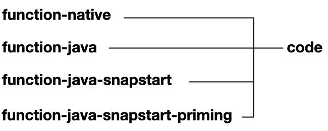
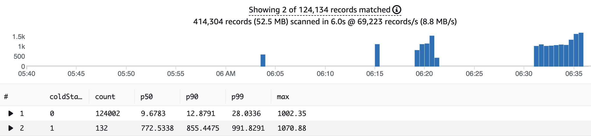

## Micronaut Framework AWS Lambda Deployments



This is a TODO serverless application built in Java with the [Micronaut Framework](https://micronaut.io) It consists of an[Amazon API Gateway](https://aws.amazon.com/api-gateway/) backed by a [AWS Lambda](https://aws.amazon.com/lambda/) function and an [Amazon DynamoDB](https://aws.amazon.com/dynamodb/) table for storage.

## Deployments

This application compares three deployment scenarios:

- FAT Jar to Java Runtime
- FAT Jar to Java Runtime + SnapStart
- Native executable built with [GraalVM](https://graalvm.org)  to a [custom AWS Lambda runtime](https://docs.aws.amazon.com/lambda/latest/dg/runtimes-custom.html).

## Module Architecture

Code is shared between every deployment. 



## Requirements

- [AWS CLI](https://aws.amazon.com/cli/)
- [AWS CDK](https://aws.amazon.com/cdk/)
- Java 11

## Build

Micronaut framework is build-agnostic. You can build applications with [Maven](https://maven.apache.org) or [Gradle](https://gradle.org). However, this project uses with Gradle. 

## Deployment

Deploy the demo to your AWS account using [AWS CDK](https://aws.amazon.com/cdk/). Module `infra` contains the CDK code.

If you have never run CDK in your AWS account, you will have to `cdk bootstrap` first.

To ease deployment, the project contains a bash script. You can deploy via: 

```bash
./deploy.sh
```

The bash script builds the FAT JARs and the native executable with GraalVM, and runs `cdk deploy`. It uses AWS CloudFormation to deploy the resources to your account.

CDK creates three outputs with the API Gateway endpoint URLs to use in our load tests.

## Load Tests

- The application uses [Gatling](https://gatling.io/) to load-testing the application. Module `loadtests` contains the Gatling load tests code.

The load test executes a simulation which runs a POST, GET, DELETE scenario with 50 concurrent users for 3 minutes and then ramps up to 100 concurrent users for extra 2 minutes.    

After deployment, you can run the load script with: 

```bash
./load.sh
```

This is a demanding load test, to change it. Edit `TodoSimulation.java` 

### CloudWatch Logs Insights

Using this [CloudWatch Logs Insights query](https://docs.aws.amazon.com/AmazonCloudWatch/latest/logs/AnalyzingLogData.html), you can analyse the latency of the requests made to the Lambda functions.

The query separates cold starts from other requests and then gives you p50, p90 and p99 percentiles.

```
filter @type="REPORT"
| fields greatest(@initDuration, 0) + @duration as duration, ispresent(@initDuration) as coldStart
| stats count(*) as count, pct(duration, 50) as p50, pct(duration, 90) as p90, pct(duration, 99) as p99, max(duration) as max by coldStart
```

#### CloudWatch Log Insights Java Runtime


#### CloudWatch Log Insights Java Runtime + SnapStart


#### CloudWatch Log Insights Java Runtime



